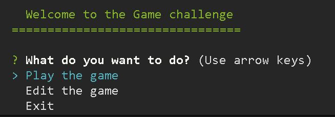
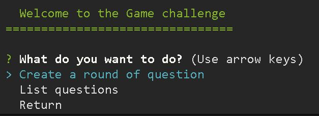

# game_app

## Overview

This app is a game in which in order to win you need to ansewer correctly several questions.

## Key topics

The following topics are covered in the
creation of the project:

- Javascript
  - Array manipulation.
  - Classes
  - Read and write files
- inquirer
  - Console manipulation
- UUID
  - Unique ID creation
- colors
  - Change appearance of text in console

## Requirements

In order to run the app, the following steps are required:

- Install Node and NPM

For Windows, please follow the next link:

https://phoenixnap.com/kb/install-node-js-npm-on-windows

For Linux, use the next commands:

```bash
sudo apt install nodejs
sudo apt install npm
node -v
npm -v
```

The last two lines is to verify the installation

- Install git

For Windows, use the next link:

https://git-scm.com/download/win

For Linux, use the next commands:

```bash
sudo apt-get install git
git --version
```

- Clone the repository

On the command line, write:

```bash
git clone https://github.com/ecastan960/gameApp.git
```

- Inside the folder of the created repository, install the dependencies with the next command:

```bash
npm install
```

## How to use the app

Once everthing is installed, you can run the file as follow:

```bash
node app
```

Once this is done, the terminal ask the user to select and option between play the game, edit the game and exit the app.



If you select to play the game, the console would ask to enter the user's name. Once this is done, it would be save in a file (user.json) so that the progress can be saved. Then you have to enter again from the main menu to start the game.

In each round, the user would have to answer one question, if it fails, the program would terminated, if it's successful, the user score and category would be updated. Once the player passes correctly 5 rounds, the challenge will be completed.

If you choose so, you can choose the cancel option from the menu to exit the program.

Now, if you select to edit the game, you would see the following menu:



if you selecte the first option, you are taken to another menu where you select the round in which you want to create the new question with their answers, also the app would ask the user to specify the right answer in each case. This information is saved in a file so that can be used every time(data.json)

The second option shows the entire collection of questions with their answers. Each
question shows which round it belongs to and what is the right answer( in green, the rest in red)
